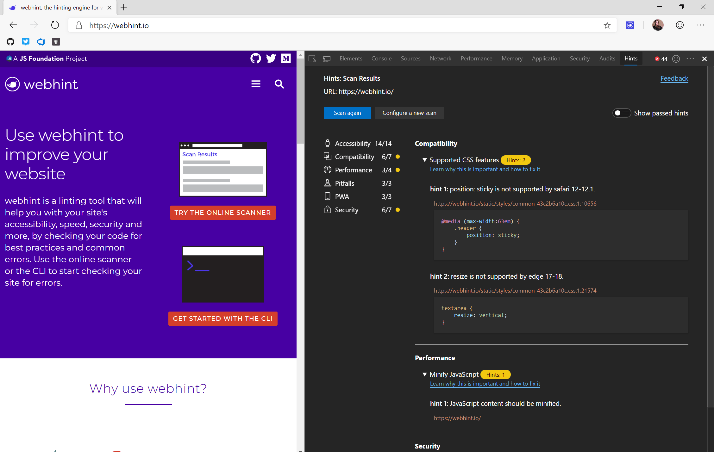
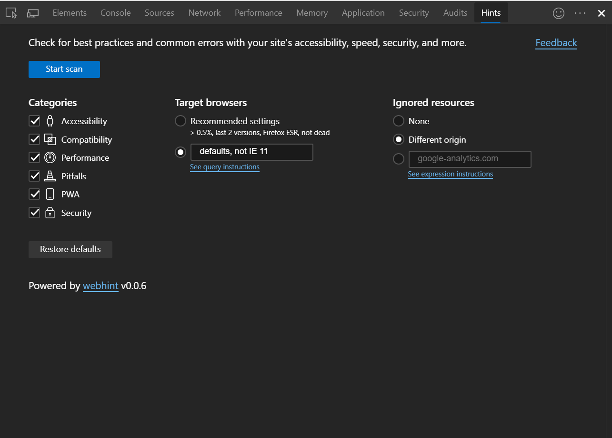

# Webhint browser extension

The webhint browser extension surfaces webhint's best practices and hints
directly in your browser's DevTools. It provides a visual interface that
allows you to run and re-run site scans that test against all browsers and
all hint types or to just a select few.

## Installation

To install the browser extension, click one of the links below and follow the
installation instructions.

 > Note: The links below redirect to externally-hosted storefronts.

- [webhint browser extension for Google Chrome](https://chrome.google.com/webstore/detail/webhint/gccemnpihkbgkdmoogenkbkckppadcag)
- [webhint browser extension for Microsoft Edge (Chromium)](https://microsoftedge.microsoft.com/insider-addons/detail/mlgfbihcfnkaenjpdcngdnhcpkdmcdee)
- [webhint browser extension for Mozilla Firefox](https://addons.mozilla.org/en-US/firefox/addon/webhint/)

## Usage

Open DevTools in the browser. Once the webhint extension is installed, it will
appear as a tab within DevTools. From here, you can customize the scan by
selecting which hint categories, browsers, or resources to include or exclude.
Click "Start scan" to begin scanning the site.

## Contributing to the extension

To contribute to the extension please read the [`CONTRIBUTING.md`][contributing]
file of the package.

<!-- Link labels -->

[contributing]: https://github.com/webhintio/hint/blob/master/packages/extension-browser/CONTRIBUTING.md
